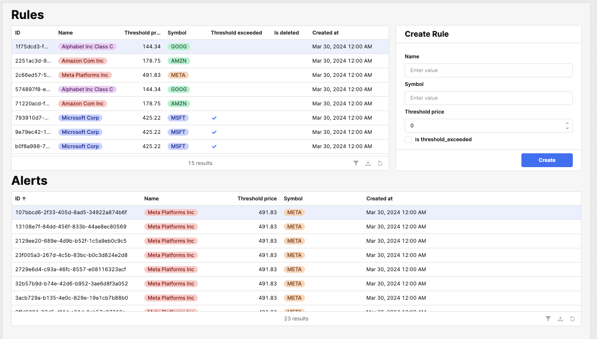
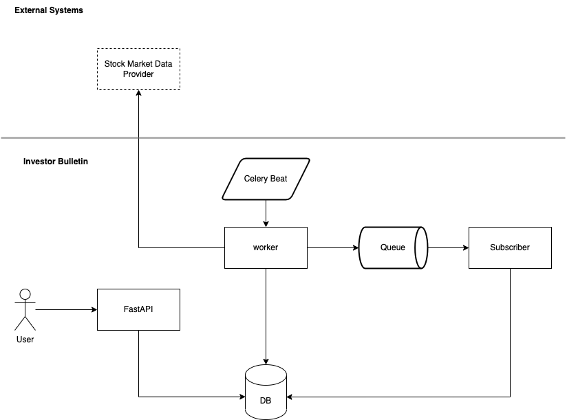

# Stock Alertify

Hey there! 👋 Welcome to Stock Alertify, your go-to tool for keeping 
an eye on the stock market without breaking a sweat. Ever noticed how 
stock investments can be a rollercoaster? High returns, but oh-so-volatile. 
That's where we come in. With Stock Alertify, you can peek at the latest prices 
and set alerts for when your favorite stocks hit your dream (or nightmare) prices.
Ready to make smarter investment moves? Let's get started!

## Quick Start
Want to dive in right away? Check out our [live demo](https://stock.mosaibah.com/docs) 
and get a feel of Stock Alertify in action!


## Technologies Used

- **Python**: 3.11 🐍
- **FastAPI**: Web framework
- **SQLAlchemy**: ORM
- **CockroachDB**: Scales horizontally 🪳
- **Pydantic**: For strict data validation
- **DigitalOcean:** Hosting? Handled


## Live Demo
Access the live demo here: [stock.mosaibah.com](https://stock.mosaibah.com/docs)

## Connecting with Retool
For access to the Retool dashboard, Contact us at: [abudrm2020@gmil.com](mailto:abudrm2020@gmil.com)




## High-Level System Architecture




## Prerequisites

Ensure you meet the following requirements before starting:

- **Docker & Docker Compose**: Installed and running on your machine.
- **RapidAPI Key**: Obtainable by signing up at [RapidAPI](https://rapidapi.com/).
- **Make**: Installed via `brew install make` on your machine.


## Installation

Follow these steps to set up your project locally:

1. Clone the repository:
   ```sh
   git clone https://github.com/Mosaibah/Stock-Alertify.git
   ```
2. Copy the environment variables template to create your own `.env` file:
   ```sh
   cp .env.example .env
   ```
3. Open the `.env` file  and add your RapidAPI key to the RAPID_API_KEY field.
4. Use the Makefile to build and start docker:
   ```sh
   make up
   ```

## Usage

### Make Commands

Check out this handy list of `make` commands

| Command              | Action                                         |
|----------------------|------------------------------------------------|
| `make up`            | Builds and starts docker compose               |
| `make down`          | Stops and removes the Docker Compose services. |
| `make worker-logs`   | Display logs from the worker service           |
| `make beat-logs`     | Display logs from the beat service             |
| `make consumer-logs` | Display logs from the consumer service         |
| `make publish-event` | Publish a new event                            |


## API Endpoints

You can access the API documentation generated by
FastAPI to test the endpoints. By default, the documentation is available at
http://localhost:8005/docs.

### Available Endpoints

- **Get Market Price**: `GET /market-price/`
  - Retrieves the current market price.
- **Get Rules**: `GET /rules/`
  - Fetches all the rules.
- **Create Rule**: `POST /rules/`
  - Creates a new rule.
- **Update Rule**: `PATCH /rules/{rule_id}`
  - Updates an existing rule.
- **Delete Rule**: `DELETE /rules/{rule_id}`
  - Deletes a rule.
- **Alerts**: `GET /alerts/`
  - Retrieves all alerts.


## Contributing

Got ideas or found a bug? Feel free to open a PR or an issue. 
All contributions are welcome!

<br>

[](https://wakatime.com/badge/user/57a3d66d-3820-42b8-b270-09f4afc66b0a/project/018e19a3-b324-4f53-90a7-2f36d2654a91)